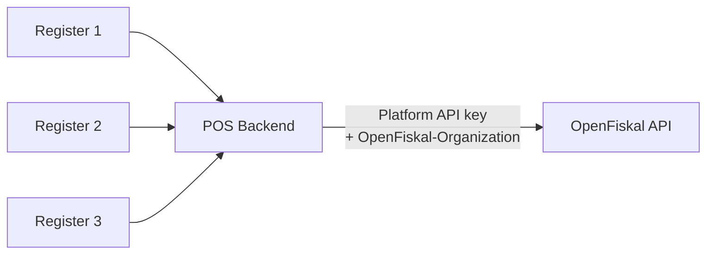
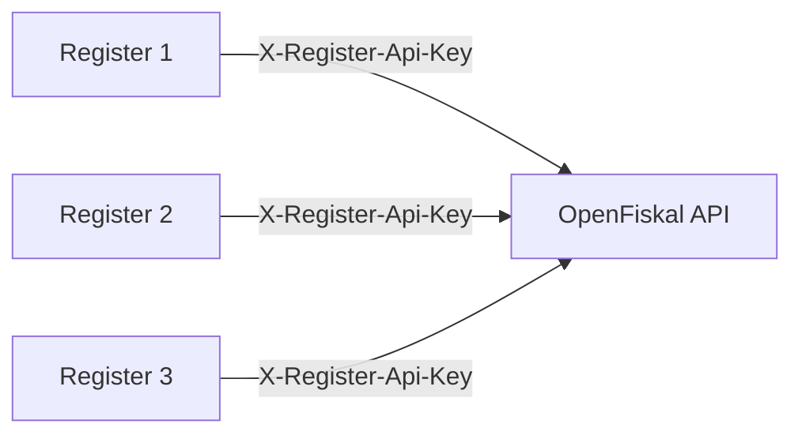
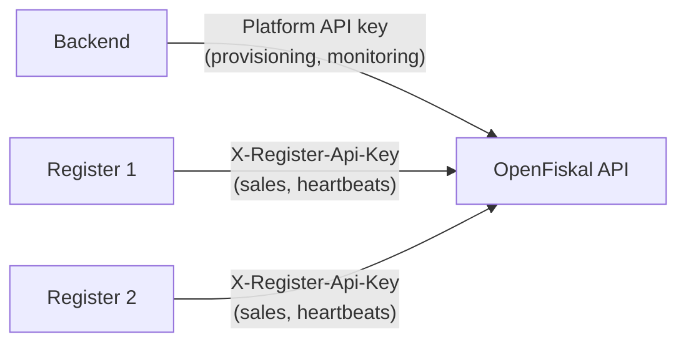

## Overview

There are two ways to connect registers to OpenFiskal:

- **Server-side** — your backend calls the API on behalf of all registers.
- **Device-direct** — each register calls the API itself, with no backend in between.

The right choice depends on whether your devices have a backend they can route through. Most POS integrations use server-side. Device-direct is for hardware that operates autonomously — EV chargers, unattended kiosks, vending machines.

<Info>
  Both topologies use the same API endpoints and produce the same fiscal outcomes. The difference is where the credentials live and who makes the HTTP calls.
</Info>

## Server-side

Your backend server holds a platform API key and sends it directly in the `Authorization: Bearer` header on every request. The registers themselves never talk to OpenFiskal.



**How it works:**

1. Your backend includes the platform API key in the `Authorization: Bearer` header on every request.
2. When a register reports a sale, your backend calls `POST /registers/:id/sales` with the API key and the `OpenFiskal-Organization` header.
3. OpenFiskal returns the fiscal document. Your backend passes the receipt data back to the register.

**When to use it:**

- Traditional POS systems with a backend (restaurant, retail, hospitality)
- Cloud-based POS where the server already manages register state
- Any setup where devices have reliable connectivity to your own infrastructure

**Advantages:**

- One API key to manage — no per-device key distribution.
- The API key stays on your server, never on hardware that could be physically compromised.
- Single key works across all organizations and registers.
- Backend can add business logic (validation, enrichment) before calling OpenFiskal.

**Disadvantages:**

- Extra dependency — fiscal calls go register → backend → OpenFiskal. If the backend is down, registers must queue locally until it recovers (see [Offline Guidance](/offline-guidance)).
- Adds latency — every fiscal call round-trips through your server.
- You must build and operate the backend.

## Device-direct

Each register holds its own long-lived API key and calls OpenFiskal directly. No backend is involved in fiscal operations.



**How it works:**

1. During provisioning, your backend creates the register and fiscal unit with `issue_register_credential: true`. This returns a one-time register API key.
2. You securely push the API key to the device (over a provisioning channel, device management platform, or at manufacturing time).
3. The device includes the key in the `X-Register-Api-Key` header for all API calls.

**When to use it:**

- Unattended hardware — EV chargers, fuel pumps, vending machines, self-service kiosks.
- Devices that operate without reliable connectivity to your own backend.
- Edge deployments where a central server is impractical.

**Advantages:**

- No backend dependency for fiscal operations — the device talks directly to OpenFiskal.
- Simpler architecture for autonomous hardware.
- Each device is independent — one going offline does not affect the others.

**Disadvantages:**

- One API key per register. At 500 devices, that is 500 keys to distribute and track.
- Keys are long-lived and stored on physical hardware — a stolen device means a compromised key. Rotate immediately via `POST /registers/:id/credentials/rotate`.
- The device firmware must handle retries and offline queuing directly (see [Offline Guidance](/offline-guidance)).

## Choosing a topology

| Factor | Server-side | Device-direct |
|---|---|---|
| Credential management | One platform API key | One API key per device |
| Backend required | Yes | Only for provisioning |
| Credential exposure risk | Low (server only) | Higher (on physical hardware) |
| Offline queuing | At the backend (if OpenFiskal is unreachable) or at the register (if your backend is unreachable) | At the register (if OpenFiskal is unreachable) |
| Typical use case | Attended POS (restaurant, retail) | Unattended hardware (EV, kiosk, vending) |

<Tip>
  If you are unsure, start with server-side. It is easier to manage and more secure. Switch to device-direct only if your devices genuinely cannot route through a backend.
</Tip>

## Hybrid approach

Some integrations use both. The backend handles provisioning, fleet management, and monitoring (using platform API keys), while the registers handle real-time fiscal operations directly (using register API keys).



This is common for EV charging networks: a fleet management platform provisions and monitors chargers centrally, but each charger handles its own fiscal operations over cellular.

## Provisioning device-direct registers

For device-direct integrations, provisioning involves three steps — all done from your backend using platform API keys:

<Steps>
  <Step title="Create the register">
    ```bash
    curl -X POST https://api.openfiskal.com/v1/locations/loc_01HXYZ/registers \
      -H "Authorization: Bearer $API_KEY" \
      -H "OpenFiskal-Organization: org_01HXYZ" \
      -H "Content-Type: application/json" \
      -d '{
        "label": "Charger A-042",
        "jurisdiction": "DE"
      }'
    ```
  </Step>
  <Step title="Create a fiscal unit with a register API key">
    Pass `issue_register_credential: true` to receive a device-scoped API key.

    ```bash
    curl -X POST https://api.openfiskal.com/v1/registers/reg_01HXYZ/fiscal-units \
      -H "Authorization: Bearer $API_KEY" \
      -H "OpenFiskal-Organization: org_01HXYZ" \
      -H "Content-Type: application/json" \
      -d '{ "issue_register_credential": true }'
    ```

    ```json
    {
      "object": "fiscal_unit_response",
      "fiscal_unit": { "id": "fu_01HXYZ", "state": "active" },
      "register_api_key": "ofk_reg_live_...",
      "credential_issued": true
    }
    ```

    <Warning>
      The API key is returned **once**. Store it immediately. It cannot be retrieved again.
    </Warning>
  </Step>
  <Step title="Push the key to the device">
    Deliver the API key and register ID to the device over a secure channel — your device management platform (MDM), a secure provisioning API, or a factory burn process.

    The device stores these two values and uses them for all subsequent API calls:
    - `register_id` — to build endpoint URLs (`/registers/:id/sales`, etc.)
    - `register_api_key` — for the `X-Register-Api-Key` header
  </Step>
</Steps>

## Key rotation

If a device is compromised, lost, or replaced, rotate the API key immediately from your backend:

```bash
curl -X POST https://api.openfiskal.com/v1/registers/reg_01HXYZ/credentials/rotate \
  -H "Authorization: Bearer $API_KEY" \
  -H "OpenFiskal-Organization: org_01HXYZ"
```

The old key is revoked instantly. Push the new key to the replacement device before it attempts any API calls.

## Next steps

<CardGroup cols={2}>
  <Card title="Authentication" icon="key" href="/auth">
    API key types, organization scoping, and key management.
  </Card>
  <Card title="Register Lifecycle" icon="microchip" href="/register-lifecycle">
    Commissioning, monitoring, and decommissioning registers.
  </Card>
  <Card title="POS Operations" icon="cash-register" href="/pos-operation-ingestion">
    The operation lifecycle — start, mutate, complete, abandon.
  </Card>
  <Card title="Offline Guidance" icon="wifi-slash" href="/offline-guidance">
    Handling connectivity loss with local queuing and ordered replay.
  </Card>
</CardGroup>
