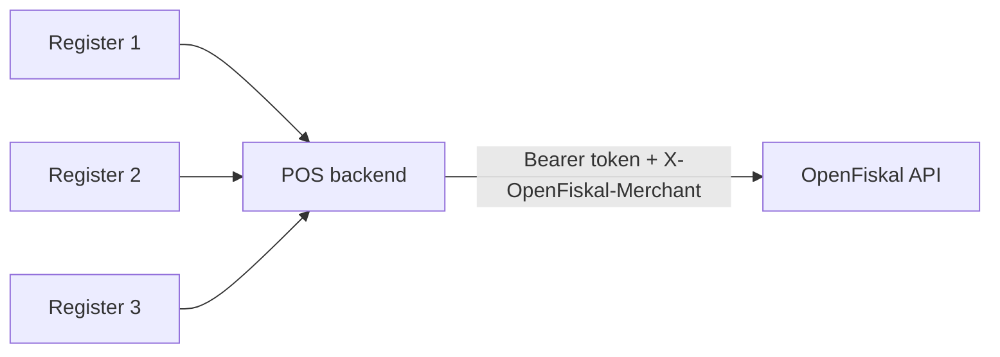

## Overview

OpenFiskal currently supports one public integration topology: server-to-server.

Your backend holds the API key, adds the merchant-scoping header, and calls OpenFiskal on behalf of your locations and registers. Registers, browsers, and mobile apps should never call the API directly.

## Not supported

The public API does not currently support device-direct authentication or direct calls from POS clients. If you have an edge-device use case, route it through your backend for now.

## POS vs ONLINE operations

Every operation carries a `source` discriminator that affects which fields are required:

| `source` | When | `register_id` |
| --- | --- | --- |
| `POS` | Operation originated at a physical register on a fiscalized location | **Required** |
| `ONLINE` | Operation originated in an online channel (web checkout, in-app purchase, etc.) | **Forbidden** |

Sending `register_id` on an `ONLINE` operation, or omitting it on a `POS` operation, is rejected with `422 validation_error`. Sessions exist only for `POS` — `ONLINE` operations have no session and no register-level cash drawer to bind to.

## Next steps

- [Authentication](/auth)
- [Register lifecycle](/register-lifecycle)
- [POS operations](/pos-operation-ingestion)