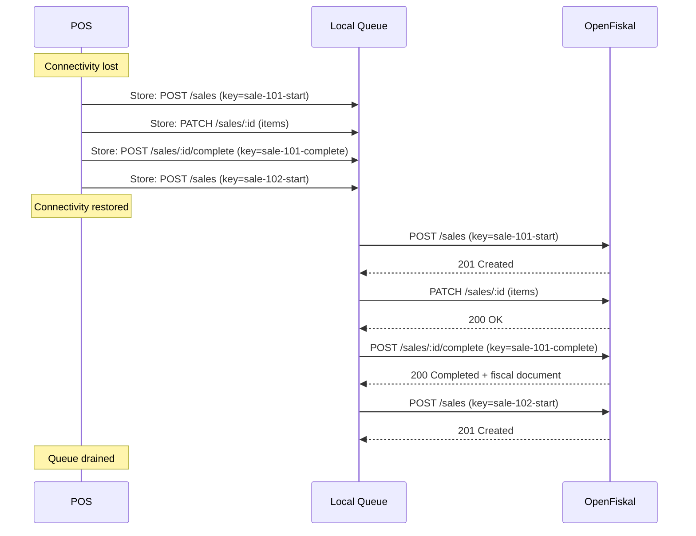

## Overview

POS devices lose internet connectivity — network outages, Wi-Fi drops, mobile dead zones. When that happens, the register must continue operating. Customers cannot wait for a reconnection to pay.

The pattern is simple: **queue operations locally, sync them when connectivity returns, and let OpenFiskal handle the fiscal outcome.** OpenFiskal decides what happens jurisdiction by jurisdiction — whether operations are signed retroactively, left unsigned, or transmitted later. Your POS does not need to know the rules.

<Info>
  No special "offline mode" API exists. You use the same endpoints (`POST /sales`, `PATCH /sales/:id`, `POST /sales/:id/complete`) — just delayed. Idempotency keys and device-side timestamps make this safe.
</Info>

## What to queue

When the API is unreachable, persist the full operation payload locally on the device. Every call you would have made online — start, mutate, complete — becomes an entry in the local queue.

Each queued entry must include:

- **The full request payload** — headers, body, and method, exactly as you would send it online.
- **An `Idempotency-Key`** — generated at the time of the action, not at sync time. This is what makes retries safe.
- **A device-side timestamp** — record when the event actually occurred on the register's local clock.

<Warning>
  Use the register's local clock for timestamps, not the time the API call eventually succeeds. The fiscally relevant moment is when the cashier pressed the button, not when the network came back.
</Warning>

Store the queue in durable local storage — a local database, file, or embedded store that survives app restarts and crashes. An in-memory queue is not sufficient.

## How to sync

When connectivity returns, replay the queued operations **in order** using the same endpoints you would have called online. Each request carries the `Idempotency-Key` that was generated at queue time.

The flow:



Key rules:

1. **Replay in order.** Operations must be synced in the same sequence they occurred. A `complete` cannot arrive before its `start`.
2. **Use the original idempotency key.** If a request fails mid-sync (e.g., a second network drop), retry with the same key. The server deduplicates automatically.
3. **Do not modify payloads.** Send exactly what was queued. Do not recalculate timestamps, amounts, or keys at sync time.

<Tip>
  On a successful response, remove the entry from the queue. On a network error, stop and retry later — do not skip entries.
</Tip>

## Timestamps

OpenFiskal distinguishes two timestamps:

| Timestamp | Source | Meaning |
|---|---|---|
| `occurred_at` | Device clock (you send this) | When the event actually happened at the register. This is the fiscally relevant timestamp. |
| `received_at` | Server clock (OpenFiskal records this) | When the server received the API call. May be minutes or hours after `occurred_at` if the register was offline. |

The `occurred_at` timestamp is what appears on the receipt and in the fiscal record. `received_at` is an audit field — it shows when the data arrived at the server.

### Clock drift detection

The heartbeat response includes a `server_time` field. Compare it against the register's local clock after each heartbeat. If the drift exceeds a few seconds, log a warning — significant drift is a fiscal risk in jurisdictions that require accurate timestamps.

```json
{
  "object": "heartbeat_response",
  "received_at": "2026-02-26T14:30:00Z",
  "server_time": "2026-02-26T14:30:00Z"
}
```

## Jurisdiction behavior

When operations arrive late, OpenFiskal handles the fiscal outcome per regime. Your POS does not need to branch on jurisdiction — send the same payloads regardless.

| Regime | Signing | Transmission |
|---|---|---|
| TSE (Germany) | Not signed — the TSE was unavailable offline. The operation is recorded without a TSE signature. | N/A (transmission is batch, not real-time) |
| RKSV (Austria) | Signed retrospectively when the operation reaches the server. The signature chain is maintained. | Transmitted to FinanzOnline as normal. |
| RT (Italy) | Signed when the operation reaches the server. | Not forwarded to Agenzia delle Entrate — late operations are excluded from real-time transmission. |

<Info>
  The fiscal document in the API response reflects the actual outcome. If a TSE signature was not produced, the `start_event` and `end_event` fields will indicate this. The POS prints whatever is returned — no special handling needed.
</Info>

## Heartbeat and monitoring

While offline, the register cannot send heartbeats. OpenFiskal detects this: after 2x the expected heartbeat interval with no signal, the register status transitions to `offline`.

When connectivity returns:

1. Resume heartbeats immediately.
2. Include `metrics.unsynced_operations` in the heartbeat payload — this tells the server how many queued operations are waiting to be synced.

```json
{
  "timestamp": "2026-02-26T15:00:00Z",
  "sequence": 4829,
  "status": "operational",
  "metrics": {
    "unsynced_operations": 12,
    "pending_operations": 0
  }
}
```

The register status transitions back to `operational` once heartbeats resume. The server can monitor the `unsynced_operations` count to track sync progress.

## Daily closing

All queued operations must be synced and either completed or abandoned before calling `POST /registers/:id/closings`.

<Warning>
  The closing endpoint returns `409 Conflict` if open operations remain on the register. Drain the queue and complete or abandon every operation before triggering the closing.
</Warning>

If the register was offline for part of the day, the closing sequence is:

1. Reconnect and resume heartbeats.
2. Replay all queued operations in order.
3. Verify no open operations remain (`GET /registers/:id/status`).
4. Call `POST /registers/:id/closings`.

## POS implementation checklist

Your POS must implement the following to support offline operation:

- **Local persistence** — durable storage for queued operations that survives restarts and crashes.
- **Ordered replay** — sync queued operations in the exact order they occurred.
- **Idempotency keys** — generate a unique key for every `start` and `complete` action at queue time, and reuse it on retry.
- **Device-side timestamps** — record `occurred_at` from the register's local clock at the time of the event.
- **Clock accuracy** — compare `server_time` from heartbeat responses against the local clock and alert on significant drift.
- **Queue drain before closing** — block the daily closing until all queued operations are synced and completed or abandoned.
- **Heartbeat `unsynced_operations`** — report the queue depth in heartbeat metrics so the server knows the register has a backlog.

## Next steps

<CardGroup cols={2}>
  <Card title="POS Operations" icon="cash-register" href="/pos-operation-ingestion">
    The operation lifecycle — start, mutate, complete, abandon.
  </Card>
  <Card title="Register Lifecycle" icon="microchip" href="/register-lifecycle">
    Commissioning, monitoring, and decommissioning registers.
  </Card>
  <Card title="Authentication" icon="key" href="/auth">
    Credential types, token flows, and organization scoping.
  </Card>
</CardGroup>
