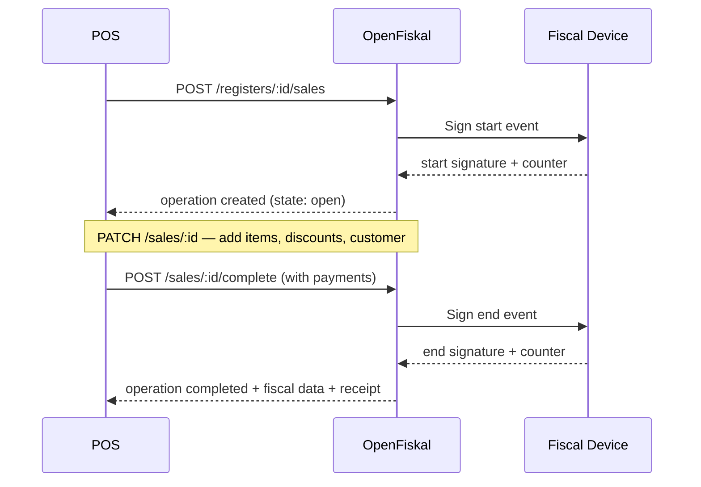

## The deal

You build the POS. We handle fiscalization.

Every event that happens on a register — a sale, a refund, a cash drawer movement — must be reported to OpenFiskal as a **POS operation**. We sign it, store it, and return the fiscal data your receipt needs. You print it.

That's the contract: **you send us what happened, we make it legally compliant.**

## What is a POS operation?

A POS operation is anything that happens at a register that has fiscal relevance. Each operation follows a simple lifecycle:

<Steps>
  <Step title="Start">
    Your POS tells OpenFiskal that something is happening — a sale was opened, a refund initiated, cash was moved.

    This is already a fiscal event. In Germany, the TSE signs the start immediately. We return the start signature and a transaction counter. **Store these — they go on the receipt.**
  </Step>
  <Step title="Mutate (optional)">
    While the operation is open, your POS can freely update it — add line items, apply discounts, attach customer data. These mutations are not fiscal events. No signatures, no counters. Just data updates.
  </Step>
  <Step title="Complete">
    Your POS sends the final payment data and tells us to close the operation.

    We sign the end event, generate the fiscal document, and return everything: end signature, document number, receipt data, QR code payload. **This is what goes on the printed receipt.**
  </Step>
</Steps>



## Operation types

You only implement the operation types that exist in your system. If your POS doesn't handle deposits, don't send deposits. If you never do exchanges, skip them.

| Type | When to use it |
|---|---|
| `sale` | Customer buys something. The most common operation. |
| `refund` | Full or partial return of a prior sale. References the original. |
| `exchange` | Customer returns items and buys new ones in a single transaction. |
| `void` | Same-day cancellation of a completed operation. Must happen before the daily closing. |
| `cash_movement` | Cash added to or removed from the drawer — opening float, safe drops, banking. Not a sale. |
| `deposit` | Customer prepays or places a reservation. |
| `deposit_capture` | Finalizes a prior deposit when the customer picks up or completes the purchase. |
| `training` | Staff practice transaction. Not fiscalized — no real fiscal document is generated. |

<Info>
  Every operation type follows the same lifecycle: **start → mutate → complete** (or **abandon**). The API surface is consistent across all types. Learn one, you know them all.
</Info>

## Your responsibilities

As the POS vendor, you are responsible for:

1. **Reporting every fiscal event as it happens.** When a cashier opens a sale, you call us. When the customer pays, you call us. Don't batch, don't delay, don't skip.

2. **Printing what we return.** The fiscal data in our response — signatures, counters, QR codes, document numbers — must appear on the receipt exactly as returned. This is a legal requirement in every jurisdiction we support.

3. **Handling the open state.** Multiple operations can be open at the same time on the same register. A restaurant with four tables has four open sales. Your POS manages the UI; we manage the fiscal state.

4. **Completing or abandoning every operation.** An operation that was started must eventually be completed or explicitly abandoned. Open operations block the daily closing.

5. **Triggering the daily closing.** At the end of the business day (or shift), call the closing endpoint. We generate the fiscal closing report (Z-report in Germany, chiusura giornaliera in Italy).

## What you don't need to worry about

OpenFiskal handles:

- **Signing.** TSE in Germany, RKSV in Austria, RT in Italy — we manage the fiscal security devices and their signature chains.
- **Transmission.** Where the jurisdiction requires it (Italy RT, Austrian BMF), we transmit to the tax authority on your behalf.
- **Jurisdiction differences.** You send the same API calls regardless of country. We handle the mapping, the signing, and the document format.
- **Receipt rendering.** We provide a receipt API with structured data and PDF rendering. You can use ours or build your own from the data we return.
- **Audit trail.** Every operation, every signature, every counter value is stored and can be replayed.

## Data model

Our data model is designed to be a superset of what POS systems typically carry. Line items, discounts (both line-level and cart-level), tax breakdowns, payment methods, customer data — it should map cleanly to your existing structures.

A few things to know:

- **All monetary amounts are integers in the minor currency unit.** Cents for EUR, pennies for GBP. No floats, ever. `1800` means 18.00 EUR.
- **Tax rates are decimal strings.** `"0.19"` for 19% German standard rate. Strings avoid floating-point precision issues.
- **Discounts are explicit.** Line-level discounts live on the line item. Cart-level discounts (coupons, promotions) are declared at the operation level and we allocate them across line items. Every intermediate value is computed and stored — nothing is derived at render time.
- **Payments model the full flow.** Cash tendered + change is two payment lines (`inbound` + `outbound`), not a single net amount. Split payments across methods are first-class.

<Tip>
  If something exists in your POS data model that doesn't have a field in ours, use the `metadata` object on any resource. It accepts arbitrary key-value pairs and is stored as-is.
</Tip>

## What happens at completion

When you complete an operation, the response contains everything needed for the receipt:

```json
{
  "id": "op_01HXYZ",
  "type": "sale",
  "state": "completed",
  "fiscal": {
    "jurisdiction": "DE",
    "document_number": "2026-004822",
    "start": {
      "signed_at": "2026-02-25T19:02:11Z",
      "transaction_counter": 4821,
      "signature": "base64encodedStartSignature=="
    },
    "end": {
      "signed_at": "2026-02-25T20:14:55Z",
      "transaction_counter": 4822,
      "signature": "base64encodedEndSignature=="
    },
    "verification": {
      "qr_data": "V0;Kasse1;ecdsa-plain-SHA256;..."
    }
  }
}
```

The `fiscal.verification.qr_data` field is the exact string you encode into the QR code on the receipt. In Germany, this follows the DSFinV-K format. In Italy, it's a verification URL. We handle the format — you just print it.

## Next steps

<CardGroup cols={2}>
  <Card title="Authentication" icon="key" href="/auth">
    Set up your platform credentials and learn about the token flow.
  </Card>
  <Card title="API Reference" icon="code" href="/api-reference/introduction">
    Explore the full API surface — endpoints, schemas, and examples.
  </Card>
</CardGroup>
