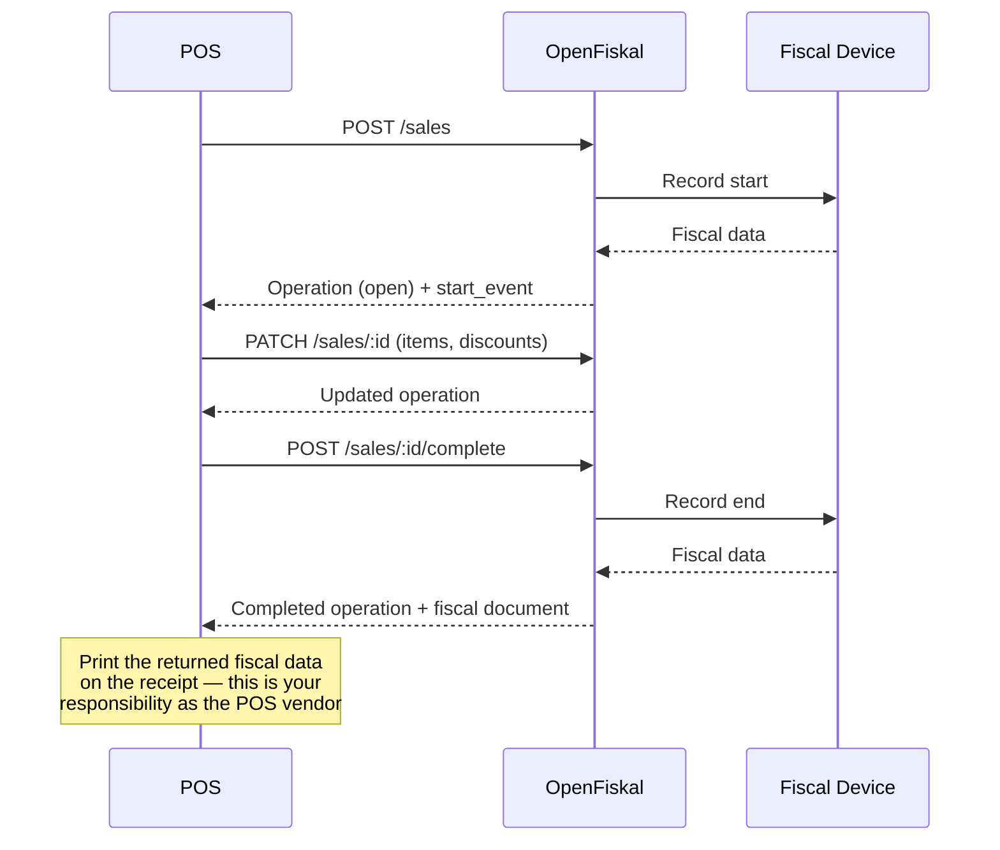

## Overview

OpenFiskal handles fiscalization so your POS doesn't have to.

Every event that occurs at a register — a sale, a refund, a cash drawer movement — is reported to OpenFiskal as a **POS operation**. We sign it, store it, and return the fiscal data required for the receipt. Your POS prints it.

The integration model is straightforward: **your POS reports what happened, and OpenFiskal makes it legally compliant.**

## What is a POS operation?

A POS operation is anything that happens at a register that has fiscal relevance. Each operation follows a simple lifecycle:

<Steps>
  <Step title="Start">
    The POS notifies OpenFiskal that an event has begun — a sale opened, a refund initiated, or cash moved.

    This is already a fiscal event. The fiscal security device signs the start immediately. OpenFiskal returns the start signature and transaction counter. **Store these values — they are required on the receipt.**
  </Step>
  <Step title="Mutate (optional)">
    While the operation is open, the POS may update it freely — adding line items, applying discounts, or attaching customer data. These mutations are not fiscal events and do not produce signatures or counter values.
  </Step>
  <Step title="Complete">
    The POS submits the final payment data and requests completion.

    OpenFiskal signs the end event, generates the fiscal document, and returns the full set of receipt data: end signature, document number, and QR code payload. **These fields must appear on the printed receipt.**
  </Step>
</Steps>

### State machine

An operation has two independent states:

- **Operation state** — tracks the POS lifecycle: is the sale open, completed, or cancelled?
- **Fiscal state** — tracks fiscalization: has the fiscal device successfully recorded the event?

#### Operation state

```
[open] ──► [completed]
  │
  └──► [cancelled]
```

- **open**: The operation is in progress. Line items, discounts, and customer data can be added or changed freely (mutations are not fiscal events).
- **completed**: The POS has finalized the operation — payment collected, sale done.
- **cancelled**: The POS cancelled the operation before completion. The POS resets.

#### Fiscal state

```
[pending] ──► [succeeded]
  │
  └──► [failed]
```

- **pending**: Fiscalization has not yet been attempted or is in progress.
- **succeeded**: The fiscal device successfully recorded the event. Fiscal data (signatures, counters, document numbers) is available.
- **failed**: Fiscalization failed (device unreachable, transmission error). The POS should retry.

#### How they relate

| Operation state | Fiscal state | Meaning |
|---|---|---|
| `open` | `pending` | Sale in progress, not yet fiscalized |
| `open` | `succeeded` | Start event recorded (regime-dependent, e.g. Germany TSE) |
| `completed` | `pending` | Sale finished, fiscalization not yet confirmed |
| `completed` | `succeeded` | Happy path — fiscal data available, print the receipt |
| `completed` | `failed` | Sale finished but fiscalization failed — retry |
| `cancelled` | `pending` | Sale cancelled before any fiscal event |
| `cancelled` | `succeeded` | Sale cancelled, but start was already recorded (e.g. Germany TSE) |

<Info>
  The POS drives the operation state. OpenFiskal drives the fiscal state. Your POS should always check `fiscal.state` before printing — only print fiscal data on the receipt when it is `succeeded`.
</Info>

To reverse a completed operation before the daily closing, create a separate `void` operation that references the original. After the closing, use a `refund` instead.



## Operation types

Implement only the operation types that apply to your system. If your POS does not handle deposits, there is no need to send them.

| Type | When to use it |
|---|---|
| `sale` | Customer buys something. The most common operation. |
| `refund` | Full or partial return of a prior sale. References the original. |
| `exchange` | Customer returns items and buys new ones in a single transaction. |
| `void` | Cancellation of a completed operation before the daily closing. Produces a fiscal reversal document. |
| `cash_movement` | Cash added to or removed from the drawer — opening float, safe drops, banking. Not a sale. |
| `deposit` | Customer prepays or places a reservation. |
| `deposit_capture` | Finalizes a prior deposit when the customer picks up or completes the purchase. |
| `training` | Staff practice transaction. Not fiscalized — no real fiscal document is generated. |

<Info>
  Every operation type follows the same lifecycle: **start → mutate → complete** (or **cancel**). The API surface is identical across all types.
</Info>

## POS vendor responsibilities

As the POS vendor, your integration must:

1. **Report every fiscal event in real time.** When a cashier opens a sale, call the API. When the customer pays, call the API. Events must not be batched, delayed, or omitted.

2. **Print the returned fiscal data verbatim.** Signatures, counters, QR codes, and document numbers in the response must appear on the receipt exactly as returned. This is a legal requirement in every supported jurisdiction.

3. **Manage concurrent open operations.** Multiple operations may be open simultaneously on the same register (e.g., a restaurant serving several tables). The POS manages the user interface; OpenFiskal manages the fiscal state.

4. **Complete or cancel every operation.** Any operation that has been started must eventually be completed or explicitly cancelled. Open operations block the daily closing.

5. **Trigger the daily closing.** At the end of the business day or shift, call `POST /registers/:id/closings`. OpenFiskal generates the fiscal closing report required by the jurisdiction. All open operations must be completed or cancelled first.

## What OpenFiskal handles

- **Signing.** Fiscal security devices and their signature chains are fully managed, regardless of jurisdiction.
- **Transmission.** Where required, fiscal data is transmitted to the tax authority automatically.
- **Jurisdiction abstraction.** The POS sends the same API calls regardless of country. OpenFiskal handles regime-specific mapping, signing, and document formatting.
- **Receipt rendering.** A receipt API provides structured data and PDF rendering. Use it directly, or build a custom renderer from the returned data.
- **Audit trail.** Every operation, signature, and counter value is stored and available for replay.

## Data model

The data model is designed as a superset of what POS systems typically carry — line items, discounts (both line-level and cart-level), tax breakdowns, payment methods, and customer data — and should map cleanly to existing POS structures.

Key conventions:

- **All monetary amounts are integers in the minor currency unit.** Cents for EUR, pennies for GBP. Floats are never used. `1800` means 18.00 EUR.
- **Tax rates are decimal strings.** `"0.19"` for 19%, `"0.10"` for 10%. Strings avoid floating-point precision issues.
- **Discounts are explicit.** Line-level discounts are attached to the line item. Cart-level discounts (coupons, promotions) are declared at the operation level, and OpenFiskal allocates them across line items. Every intermediate value is computed and stored — nothing is derived at render time.
- **Payments model the full flow.** Cash tendered and change are represented as two payment lines (`inbound` + `outbound`), not a single net amount. Split payments across methods are fully supported.

<Tip>
  For POS data that does not map to a dedicated field, use the `metadata` object available on any resource. It accepts arbitrary key-value pairs and is stored as-is.
</Tip>

## The fiscal document

When an operation is completed, OpenFiskal attaches a **fiscal document** — the jurisdiction's proof that the transaction was recorded, signed, numbered, and tamper-evident.

The POS does not construct the fiscal document. OpenFiskal generates it and returns it in the completion response. The POS prints the returned data on the receipt.

The `fiscal` field on every operation is a `FiscalDocument` — a discriminated union keyed on `regime`. Each regime variant carries fully typed fields specific to its fiscal security device and signing protocol. There is no opaque metadata bag; every field is documented and predictable.

<Tabs>
  <Tab title="TSE (Germany)">
    The TSE signs **twice** per operation — once at open (`start_event`) and once at completion (`end_event`). Each event consumes an independent transaction counter value. Both signatures must appear on the printed receipt.

    ```json
    {
      "regime": "tse",
      "fiscal_unit_id": "fu_01HXYZ",
      "document_number": "2026-004822",
      "document_type": "Kassenbeleg",
      "transmission_status": "transmitted",
      "transmitted_at": "2026-02-25T20:15:01Z",
      "tse_serial": "abc123def456",
      "client_id": "Register1",
      "signature_algorithm": "ecdsa-plain-SHA384",
      "time_format": "utcTime",
      "start_event": {
        "signed_at": "2026-02-25T19:02:11Z",
        "transaction_counter": 4821,
        "signature": "base64encodedStartSignature==",
        "process_type": null,
        "process_data": null
      },
      "end_event": {
        "signed_at": "2026-02-25T20:14:55Z",
        "transaction_counter": 4822,
        "signature": "base64encodedEndSignature==",
        "process_type": "Kassenbeleg-V1",
        "process_data": "Beleg^42.50_0.00_0.00_0.00_0.00^42.50:Bar"
      },
      "verification": {
        "qr_data": "V0;Register1;ecdsa-plain-SHA384;2026-02-25T19:02:11;2026-02-25T20:14:55;42.50;4822;base64encodedEndSignature=="
      }
    }
    ```

    The `verification.qr_data` field follows the DSFinV-K format. Encode it into the QR code on the receipt as-is.
  </Tab>
  <Tab title="RKSV (Austria)">
    RKSV signs **once** at completion. The signature chains to the previous receipt via an encrypted turnover counter, forming a tamper-evident sequence.

    ```json
    {
      "regime": "rksv",
      "fiscal_unit_id": "fu_01HXYZ",
      "document_number": "2026-004822",
      "document_type": "Beleg",
      "transmission_status": "transmitted",
      "transmitted_at": "2026-02-25T20:15:01Z",
      "cashbox_id": "KASSE-001",
      "certificate_serial": "abc123",
      "signature": {
        "signed_at": "2026-02-25T20:14:55Z",
        "transaction_counter": 4822,
        "turnover_counter": "encrypted-turnover-value",
        "signature": "base64encodedSignature==",
        "certificate_serial": "abc123"
      },
      "verification": {
        "qr_data": "_R1-AT0_KASSE-001_4822_2026-02-25T20:14:55_..."
      }
    }
    ```

    The `verification.qr_data` encodes the full receipt compact representation (machine-readable code) per the RKSV specification.
  </Tab>
  <Tab title="RT (Italy)">
    The RT device signs **once** at completion, producing a **documento commerciale** with progressive numbering within daily closing periods. Italy requires real-time transmission to the Agenzia delle Entrate — OpenFiskal handles this automatically.

    ```json
    {
      "regime": "rt",
      "fiscal_unit_id": "fu_01HXYZ",
      "document_number": "0001-0042",
      "document_type": "documento commerciale",
      "transmission_status": "transmitted",
      "transmitted_at": "2026-02-25T20:15:01Z",
      "rt_serial": "RTDEV001",
      "rt_firmware": "2.1.0",
      "progressive_number": 42,
      "daily_closing_number": 1,
      "lottery_code": "AKLF3920FL29",
      "signature": {
        "signed_at": "2026-02-25T20:14:55Z",
        "signature": "base64encodedSignature=="
      },
      "verification": {
        "url": "https://ivaservizi.agenziaentrate.gov.it/v1/...",
        "qr_data": "https://ivaservizi.agenziaentrate.gov.it/v1/..."
      }
    }
    ```

    The `verification.url` allows the customer to verify the receipt with the tax authority. Print it directly or encode it as a QR code.
  </Tab>
</Tabs>

<Info>
  The fiscal document structure varies by regime, but the integration pattern is consistent: complete the operation, receive the fiscal document, and print its contents on the receipt. POS code does not need to branch on regime — render whatever fields are present in the response.
</Info>

## Next steps

<CardGroup cols={2}>
  <Card title="Authentication" icon="key" href="/auth">
    API key types, organization scoping, and key management.
  </Card>
  <Card title="Receipts" icon="receipt" href="/receipts">
    Retrieve, render, and deliver fiscal receipts after completion.
  </Card>
  <Card title="Schemas" icon="database" href="/api-reference/schemas/sale-operation">
    Explore operation schemas, line items, and payments.
  </Card>
</CardGroup>
