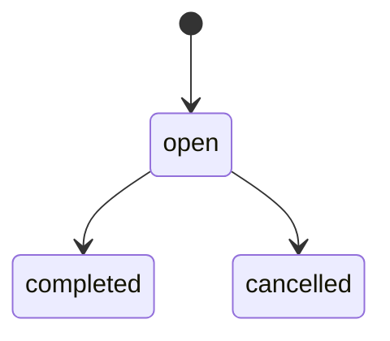

## Overview

Every fiscal event that occurs at a register is reported to OpenFiskal as an operation. Your backend sends the event, OpenFiskal applies the fiscal rules for the target regime, and the response carries the fiscal payload you need for receipts, exports, and auditability.

## Lifecycle

Each operation follows the same public lifecycle:


```mermaid
stateDiagram-v2
    [*] --> open
    open --> completed
    open --> cancelled
```

- `open` means the basket or order is still being assembled
- `completed` means the fiscal event is final
- `cancelled` means the operation was intentionally voided before completion

OpenFiskal owns this lifecycle. Clients do not send operation `status` in request payloads. They update mutable operation fields through `PATCH /operations/{operationId}`, complete the operation through `PATCH /operations/{operationId}/complete`, and cancel it through `PATCH /operations/{operationId}/cancel`.

Use a dedicated cancel action on the existing operation resource. Do not model cancellation as a separate operation type.

## Operation types

The public API currently supports these operation types:

| Type | When to use it |
| --- | --- |
| `sale` | Standard sale flow |
| `refund` | Return against an earlier sale |
| `exchange` | Return plus replacement in a single operation |
| `custom` | Platform-specific fiscal event that still needs to be recorded |

## Start an operation

Create operations with `POST /operations`. The request includes a `source` field with `POS` or `ONLINE`, an `external_id` from your own system, and a typed operation variant in `data`, such as `SaleOperation` or `RefundOperation`. The response returns the operation resource, a `resource_version`, and an `ETag` header.

```bash
curl -X POST https://api.openfiskal.com/v1/operations \
  -H "Authorization: Bearer $API_KEY" \
  -H "X-OpenFiskal-Seller: seller_01HXYZ" \
  -H "Idempotency-Key: op-order-1001-start" \
  -H "Content-Type: application/json" \
  -d '{ "...": "..." }'
```

## Update an open operation

Use `PATCH /operations/{operationId}` while the operation is still mutable. Send the latest `ETag` value in `If-Match`. This endpoint updates fiscal inputs such as amounts, line items, or related references. It does not accept a client-supplied operation `status`.

This makes retries and concurrent writers safe:

- the server owns the version
- every successful mutation returns a new `resource_version` and `ETag`
- the client retries with the same idempotency key where supported
- stale writers receive `412 precondition_failed`

## Complete an operation

Use `PATCH /operations/{operationId}/complete` when you want OpenFiskal to produce the final fiscal document and receipt state. Completion now accepts a typed `payments` array and can return `fiscal_information` for regime-specific fiscal payloads. Asynchronous payment follow-up is represented through payment-level status values, not a separate operation status.

Completion is a fiscal event. Use an idempotency key on every completion request.

## Canonical examples

### Standard sale

```json
{
  "source": "POS",
  "data": {
    "type": "sale",
    "currency": "EUR",
    "amount": 4750
  }
}
```

### Split tender

```json
{
  "payments": [
    {
      "payment_id": "pay_cash_1001",
      "method": "cash",
      "status": "captured",
      "amount": 1500,
      "currency": "EUR"
    },
    {
      "payment_id": "pay_card_1001",
      "method": "card",
      "status": "captured",
      "amount": 3250,
      "currency": "EUR"
    }
  ]
}
```

### Refund against prior receipt

```json
{
  "source": "POS",
  "data": {
    "type": "refund",
    "related_operation_id": "op_01HSALE",
    "currency": "EUR",
    "amount": 1200
  }
}
```

## Cancel an open operation

Use `PATCH /operations/{operationId}/cancel` only while the operation is still open.

```bash
curl -X PATCH https://api.openfiskal.com/v1/operations/op_01HXYZ/cancel \
  -H "Authorization: Bearer $API_KEY" \
  -H "X-OpenFiskal-Seller: seller_01HXYZ" \
  -H "Idempotency-Key: op-order-1001-cancel" \
  -H 'If-Match: "1"' \
  -H "Content-Type: application/json" \
  -d '{
    "reason": "void_before_completion"
  }'
```

Completed operations remain completed. This cancel action is not a replacement for refund or reversal workflows.

## Concurrency model

Use conditional writes with server-issued versions:

- create or read the operation
- persist the returned `ETag`
- treat `resource_version` in the body and `ETag` in the header as the same server-issued version
- send that value in `If-Match` on the next mutation
- replace your stored version after every successful mutation
- re-read on `412 precondition_failed`

## Next steps

- [Payment lifecycle](/payment-lifecycle)
- [Offline guidance](/offline-guidance)
- [Hosted Receipts API](/hosted-receipts-api)
