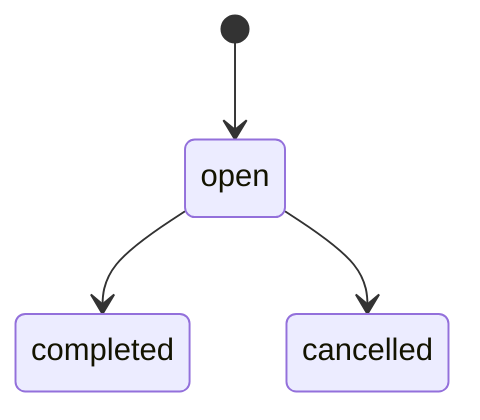

## Overview

Every fiscal event that occurs at a register is reported to OpenFiskal as an operation. Your backend sends the event, OpenFiskal applies the fiscal rules for the target regime, and the response carries the fiscal payload you need for receipts, exports, and auditability.

## Lifecycle

Each operation follows the same public lifecycle:


```mermaid
stateDiagram-v2
    [*] --> open
    open --> completed
    open --> cancelled
```

- `open` — the operation has been created but not finalized
- `completed` — the fiscal event is final and immutable
- `cancelled` — the operation was voided before completion

OpenFiskal owns this lifecycle. Clients do not send operation `status` in request payloads. They complete operations through `PATCH /operations/{operationId}/complete` and void them through `PATCH /operations/{operationId}/void`.

<Warning>
  The current API has **no generic `PATCH /operations/{id}`** endpoint. Operation bodies are immutable after `POST /operations`. Build the full line-item and amount set before creating the operation.
</Warning>

## Operation types

| Type | When to use it |
| --- | --- |
| `sale` | Standard sale flow |
| `refund` | Return against an earlier sale (set `related_operation_id`) |
| `exchange` | Return plus replacement in a single operation |

## Start an operation

Create operations with `POST /operations`. The request is flat — `source` (`POS` or `ONLINE`), `type` (`sale` / `refund` / `exchange`), `currency`, all four amount fields (`pretax_amount`, `tax_amount`, `tip_amount`, `total_amount`) as decimal strings, and `line_items`. `register_id` is required for `POS`, must be omitted for `ONLINE`. The response returns the operation resource, a `resource_version`, and an `ETag` header.

```bash
curl -X POST https://api.openfiskal.com/v1/operations \
  -H "Authorization: Bearer $API_KEY" \
  -H "X-OpenFiskal-Merchant: merchant_01HXYZ" \
  -H "Idempotency-Key: op-order-1001-start" \
  -H "Content-Type: application/json" \
  -d '{ "...": "..." }'
```

## Complete an operation

Use `PATCH /operations/{operationId}/complete` when you want OpenFiskal to produce the final fiscal document and receipt state. Completion accepts a typed `payments` array and returns `fiscal_information` for regime-specific fiscal payloads. Send the latest `ETag` in `If-Match`.

Completion is a fiscal event. Use an idempotency key on every completion request.

## Canonical examples

### Standard sale

```json
{
  "register_id": "reg_01HXYZ",
  "source": "POS",
  "type": "sale",
  "currency": "EUR",
  "pretax_amount": "44.39",
  "tax_amount": "3.11",
  "tip_amount": "0.00",
  "total_amount": "47.50",
  "line_items": [
    {
      "title": "Menu",
      "quantity": 1,
      "unit_price": "47.50",
      "total_amount": "47.50",
      "taxes": [{ "name": "MwSt. 7%", "rate": "0.07", "tax_amount": "3.11" }]
    }
  ]
}
```

### Split tender (on completion)

```json
{
  "payments": [
    {
      "payment_id": "pay_cash_1001",
      "method": "cash",
      "status": "captured",
      "amount": "15.00",
      "currency": "EUR"
    },
    {
      "payment_id": "pay_card_1001",
      "method": "card",
      "status": "captured",
      "amount": "32.50",
      "currency": "EUR"
    }
  ]
}
```

### Refund against prior receipt

```json
{
  "register_id": "reg_01HXYZ",
  "source": "POS",
  "type": "refund",
  "currency": "EUR",
  "related_operation_id": "op_01HSALE",
  "pretax_amount": "11.21",
  "tax_amount": "0.79",
  "tip_amount": "0.00",
  "total_amount": "12.00",
  "line_items": [
    {
      "title": "Menu (refund)",
      "quantity": 1,
      "unit_price": "12.00",
      "total_amount": "12.00",
      "taxes": [{ "name": "MwSt. 7%", "rate": "0.07", "tax_amount": "0.79" }]
    }
  ]
}
```

## Void an open operation

Use `PATCH /operations/{operationId}/void` only while the operation is still `open`. The endpoint is named `/void`, not `/cancel`.

```bash
curl -X PATCH https://api.openfiskal.com/v1/operations/op_01HXYZ/void \
  -H "Authorization: Bearer $API_KEY" \
  -H "X-OpenFiskal-Merchant: merchant_01HXYZ" \
  -H "Idempotency-Key: op-order-1001-void" \
  -H 'If-Match: "1"' \
  -H "Content-Type: application/json" \
  -d '{
    "reason": "void_before_completion"
  }'
```

Allowed `reason` values: `void_before_completion`, `customer_abandoned_checkout`, `operator_cancelled`, `payment_failed`.

Completed operations remain completed. Voiding is not a replacement for refund or reversal — use `type: refund` for that.

## Concurrency model

Use conditional writes with server-issued versions:

- create or read the operation
- persist the returned `ETag`
- treat `resource_version` in the body and `ETag` in the header as the same server-issued version
- send that value in `If-Match` on the next mutation (`/complete` or `/void`)
- replace your stored version after every successful mutation
- re-read on `412 precondition_failed`
- a missing `If-Match` returns `428 precondition_required`

## Next steps

- [Payment lifecycle](/payment-lifecycle)
- [Offline guidance](/offline-guidance)
