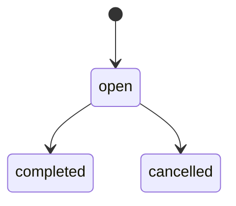

## Overview

Every fiscal event that occurs at a register is reported to OpenFiskal as an operation. Your backend sends the event, OpenFiskal applies the fiscal rules for the target regime, and the response carries the fiscal payload you need for receipts and auditability.

## Lifecycle

Each operation follows the same public lifecycle:


```mermaid
stateDiagram-v2
    [*] --> open
    open --> completed
    open --> cancelled
```

- `open` means the operation is still mutable
- `completed` means the operation is final and has produced its completion-time fiscal output
- `cancelled` means the operation was intentionally abandoned before completion

Use a dedicated cancel action on the existing operation resource. Do not model cancellation as a separate operation type.

## Operation types

The public API currently supports these operation types:

| Type | When to use it |
| --- | --- |
| `sale` | Standard sale flow |
| `refund` | Return against an earlier sale |
| `exchange` | Return plus replacement in a single operation |
| `custom` | Platform-specific fiscal event that still needs to be recorded |

## Start an operation

Create operations with `POST /operations`. The response returns `operation_id` and the first `op_revision`.

```bash
curl -X POST https://api.openfiskal.com/v1/operations \
  -H "Authorization: Bearer $API_KEY" \
  -H "X-OpenFiskal-Organization: org_01HXYZ" \
  -H "Idempotency-Key: op-order-1001-start" \
  -H "Content-Type: application/json" \
  -d '{ "...": "..." }'
```

## Update an open operation

Use `PATCH /operations/{operationId}` while the operation is still `open`. After every successful mutation, the client needs to increment `op_revision`.

## Complete an operation

Use `PATCH /operations/{operationId}/complete` when payment is final and you want OpenFiskal to produce the final fiscal document.

Completion is a fiscal event. Use an idempotency key on every completion request.

## Cancel an open operation

Use `PATCH /operations/{operationId}/cancel` only while the operation is still `open`.

```bash
curl -X PATCH https://api.openfiskal.com/v1/operations/op_01HXYZ/cancel \
  -H "Authorization: Bearer $API_KEY" \
  -H "X-OpenFiskal-Organization: org_01HXYZ" \
  -H "Idempotency-Key: op-order-1001-cancel" \
  -H "Content-Type: application/json" \
  -d '{
    "op_revision": 2,
    "reason": "customer_abandoned_checkout"
  }'
```

Completed operations remain completed. This cancel action is not a replacement for refund or reversal workflows.

## Concurrency model

`op_revision` is optimistic concurrency control owned by the caller:

- creation returns revision `1`
- the next successful mutation must send `2`
- every later mutation must send exactly the next revision

If the supplied revision is not the next expected value, the API returns `409 Conflict`.

## Receipts

Receipt retrieval and delivery live in the separate [Hosted Receipts API](/hosted-receipts-api). After an operation reaches `completed`, resolve its receipt there.

## What your backend must do

- report fiscal events in order
- preserve idempotency keys for retries
- print or deliver the returned fiscal payload exactly as provided
- complete or cancel every operation that you start

## Next steps

- [Offline guidance](/offline-guidance)
- [Hosted Receipts API](/hosted-receipts-api)
