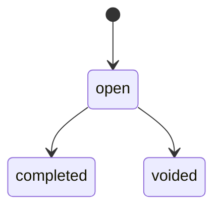

## Overview

Every fiscal event that occurs at a register is reported to OpenFiskal as an operation. Your backend sends the event, OpenFiskal applies the fiscal rules for the target regime, and the response carries the fiscal payload you need for receipts, exports, and auditability.

## Lifecycle

Each operation follows the same public lifecycle:


```mermaid
stateDiagram-v2
    [*] --> open
    open --> completed
    open --> voided
```

- `open` — the operation has been created but not finalized
- `completed` — the fiscal event is final and immutable
- `voided` — the operation was voided before completion

OpenFiskal owns this lifecycle. Clients do not send operation `status` in request payloads. They complete operations through `PATCH /operations/{operationId}/complete` and void them through `PATCH /operations/{operationId}/void`.

<Warning>
  The current API has **no generic `PATCH /operations/{id}`** endpoint. Operation bodies are immutable after `POST /operations`. Build the full line-item and amount set before creating the operation.
</Warning>

## Operation types

| Type | When to use it |
| --- | --- |
| `sale` | Standard sale flow |
| `return` | Return against an earlier sale (set `related_operation_id` or `external_related_operation`) |
| `exchange` | Return plus replacement in a single operation (set `related_operation_id` or `external_related_operation`) |

Every `return` and `exchange` must reference the original sale. Set exactly one of:

- `related_operation_id` — when the original sale exists in OpenFiskal as an operation.
- `external_related_operation` — when the original sale lives outside OpenFiskal (typical during platform migration). The object carries `description` (free-text identifying the upstream sale) and `external_operation_id` (the integrator-side identifier, e.g. the legacy POS or Shopify order ID).

Sending both fields, or neither, is rejected with `422 unprocessable_entity`. `sale` operations must not set either.

### Sign convention

Amounts carry their sign end-to-end — the API does not re-derive sale-vs-return from the operation type. Send amounts with the sign that reflects what actually moves at the register.

| Type | `total_amount` | `line_items[].total_amount` |
| --- | --- | --- |
| `sale` | ≥ 0 | ≥ 0 |
| `return` | ≤ 0 | ≤ 0 |
| `exchange` | any sign | any sign (mixed within one operation is allowed) |

The API rejects a request with the wrong sign for its type with `422 unprocessable_entity`. The operation-level arithmetic rule still holds: `pretax_amount + tax_amount + tip_amount = total_amount`. When a `return` is signed, the `pretax_amount` and `tax_amount` are negative too.

This sign is the only on-wire signal Fiskaly's TSE has for sale-vs-return, so making it explicit in the request payload keeps intent, fiscal signature, and downstream exports aligned.

## Start an operation

Create operations with `POST /operations`. The request is flat — `source` (`POS` or `ONLINE`), `type` (`sale` / `return` / `exchange`), `currency`, all four amount fields (`pretax_amount`, `tax_amount`, `tip_amount`, `total_amount`) as decimal strings, and `line_items`. `register_id` is required for `POS`, must be omitted for `ONLINE`. The response returns the operation resource, a `resource_version`, and an `ETag` header.

```bash
curl -X POST https://api.openfiskal.com/v1/operations \
  -H "Authorization: Bearer $API_KEY" \
  -H "X-OpenFiskal-Merchant: merchant_01HXYZ" \
  -H "Idempotency-Key: op-order-1001-start" \
  -H "Content-Type: application/json" \
  -d '{ "...": "..." }'
```

## Complete an operation

Use `PATCH /operations/{operationId}/complete` when you want OpenFiskal to produce the final fiscal document and receipt state. Completion accepts a typed `payments` array and returns `fiscal_information` for regime-specific fiscal payloads. Send the latest `ETag` in `If-Match`.

Completion is a fiscal event. Use an idempotency key on every completion request.

## Canonical examples

### Standard sale

```json
{
  "register_id": "reg_01HXYZ",
  "source": "POS",
  "type": "sale",
  "currency": "EUR",
  "pretax_amount": "44.39",
  "tax_amount": "3.11",
  "tip_amount": "0.00",
  "total_amount": "47.50",
  "line_items": [
    {
      "title": "Menu",
      "quantity": 1,
      "unit_price": "47.50",
      "total_amount": "47.50",
      "taxes": [{ "name": "MwSt. 7%", "rate": "0.07", "tax_amount": "3.11" }]
    }
  ]
}
```

### Split tender (on completion)

```json
{
  "payments": [
    {
      "payment_id": "pay_cash_1001",
      "method": "cash",
      "status": "captured",
      "amount": "15.00",
      "currency": "EUR"
    },
    {
      "payment_id": "pay_card_1001",
      "method": "card",
      "status": "captured",
      "amount": "32.50",
      "currency": "EUR"
    }
  ]
}
```

### Return against prior receipt

All amounts are negative: the customer is getting €12 back, goods are flowing back into stock, VAT is being reversed. The completion payload mirrors this — `payment.amount` is negative too (the merchant is paying the customer), and `status` stays `captured` so the payment counts toward the operation total.

```json
{
  "register_id": "reg_01HXYZ",
  "source": "POS",
  "type": "return",
  "currency": "EUR",
  "related_operation_id": "op_01HSALE",
  "pretax_amount": "-11.21",
  "tax_amount": "-0.79",
  "tip_amount": "0.00",
  "total_amount": "-12.00",
  "line_items": [
    {
      "title": "Menu (return)",
      "quantity": 1,
      "unit_price": "-12.00",
      "total_amount": "-12.00",
      "taxes": [{ "name": "MwSt. 7%", "rate": "0.07", "tax_amount": "-0.79" }]
    }
  ]
}
```

### Return against an external sale

Use `external_related_operation` when the original sale was rung up before the merchant moved onto OpenFiskal — typically a platform migration. The body is otherwise identical to a normal return; swap `related_operation_id` for the nested object.

```json
{
  "register_id": "reg_01HXYZ",
  "source": "POS",
  "type": "return",
  "currency": "EUR",
  "external_related_operation": {
    "description": "Return against legacy Shopify order #4711 (pre-OpenFiskal).",
    "external_operation_id": "shopify-order-4711"
  },
  "pretax_amount": "-11.21",
  "tax_amount": "-0.79",
  "tip_amount": "0.00",
  "total_amount": "-12.00",
  "line_items": [
    {
      "title": "Menu (return)",
      "quantity": 1,
      "unit_price": "-12.00",
      "total_amount": "-12.00",
      "taxes": [{ "name": "MwSt. 7%", "rate": "0.07", "tax_amount": "-0.79" }]
    }
  ]
}
```

## Exchanges

An exchange is a goods swap — the customer returns one or more items and receives replacements in the same transaction. OpenFiskal signs an exchange as a single fiscal event against the register.

### The mental model

Send the **net delta** — the amounts that actually move at the register after the returned items are offset against the replacements. The sign of each amount drives the fiscal signature:

- `total_amount` positive — customer pays the difference
- `total_amount` negative — merchant refunds the difference
- `total_amount` zero — even swap, no money moves

Include both the returned and replacement items in the same `line_items` array. Use negative `unit_price` and `total_amount` for returned items, positive for replacements, and set each item's taxes to match. Keep this sign convention on the line items regardless of whether the net delta is positive or negative — the net delta only changes the operation-level `pretax_amount`, `tax_amount`, and `total_amount`. OpenFiskal aggregates per VAT rate when it builds the signing payload, so the signed amounts reflect the net movement per rate.

The operation amounts must remain arithmetically consistent: `pretax_amount + tax_amount + tip_amount = total_amount`. When the net delta is negative, all three of `pretax_amount`, `tax_amount`, and `total_amount` are negative.

An exchange must reference the original `sale`. Set `related_operation_id` when the prior sale lives in OpenFiskal, or `external_related_operation` when it lives in a legacy system (see [Return against an external sale](#return-against-an-external-sale)).

### Customer pays the difference

Customer returns a €100 item and picks up a €150 item. Net delta: customer pays €50.

```json
{
  "register_id": "reg_01HXYZ",
  "source": "POS",
  "type": "exchange",
  "currency": "EUR",
  "related_operation_id": "op_01HSALE",
  "pretax_amount": "42.02",
  "tax_amount": "7.98",
  "tip_amount": "0.00",
  "total_amount": "50.00",
  "line_items": [
    {
      "title": "Widget (returned)",
      "quantity": 1,
      "unit_price": "-100.00",
      "total_amount": "-100.00",
      "taxes": [{ "name": "MwSt. 19%", "rate": "0.19", "tax_amount": "-15.97" }]
    },
    {
      "title": "Widget Pro (replacement)",
      "quantity": 1,
      "unit_price": "150.00",
      "total_amount": "150.00",
      "taxes": [{ "name": "MwSt. 19%", "rate": "0.19", "tax_amount": "23.95" }]
    }
  ]
}
```

Complete with a single €50 payment:

```json
{
  "payments": [
    {
      "payment_id": "pay_exch_1001",
      "method": "card",
      "status": "captured",
      "amount": "50.00",
      "currency": "EUR"
    }
  ]
}
```

### Merchant refunds the difference

Customer returns a €150 item and picks up a €100 item. Net delta: merchant refunds €10 — so `total_amount`, `pretax_amount`, and `tax_amount` are negative, but the line items keep the standard sign convention (returned item negative, replacement positive).

```json
{
  "register_id": "reg_01HXYZ",
  "source": "POS",
  "type": "exchange",
  "currency": "EUR",
  "related_operation_id": "op_01HSALE",
  "pretax_amount": "-8.40",
  "tax_amount": "-1.60",
  "tip_amount": "0.00",
  "total_amount": "-10.00",
  "line_items": [
    {
      "title": "Widget Pro (returned)",
      "quantity": 1,
      "unit_price": "-60.00",
      "total_amount": "-60.00",
      "taxes": [{ "name": "MwSt. 19%", "rate": "0.19", "tax_amount": "-9.58" }]
    },
    {
      "title": "Widget (replacement)",
      "quantity": 1,
      "unit_price": "50.00",
      "total_amount": "50.00",
      "taxes": [{ "name": "MwSt. 19%", "rate": "0.19", "tax_amount": "7.98" }]
    }
  ]
}
```

Complete with a single negative-amount payment. Keep `status: "captured"` — the payment still counts toward the operation total under the [split-tender sum rule](/payment-lifecycle#split-tender). The negative sign encodes the refund direction.

```json
{
  "payments": [
    {
      "payment_id": "pay_exch_refund_1001",
      "method": "card",
      "status": "captured",
      "amount": "-10.00",
      "currency": "EUR"
    }
  ]
}
```

### Cross-VAT exchanges

If the returned and replacement items sit at different VAT rates — for example, a 19% item returned and a 0% item taken in its place — send each line item with its own rate. The signed fiscal payload will carry a negative amount in one VAT bucket and a positive amount in the other. This is the correct representation and is preserved in the KassenSichV QR code and DSFinV-K export.

### Even swaps

For a zero-net exchange, send `total_amount: "0.00"` and a single payment with `amount: "0.00"`. The API requires at least one payment entry on completion.

## Void an open operation

Use `PATCH /operations/{operationId}/void` only while the operation is still `open`. The endpoint is named `/void`, not `/cancel`.

```bash
curl -X PATCH https://api.openfiskal.com/v1/operations/op_01HXYZ/void \
  -H "Authorization: Bearer $API_KEY" \
  -H "X-OpenFiskal-Merchant: merchant_01HXYZ" \
  -H "Idempotency-Key: op-order-1001-void" \
  -H 'If-Match: "1"' \
  -H "Content-Type: application/json" \
  -d '{
    "reason": "void_before_completion"
  }'
```

Allowed `reason` values: `void_before_completion`, `customer_abandoned_checkout`, `operator_cancelled`, `payment_failed`.

Completed operations remain completed. Voiding is not a replacement for return or reversal — use `type: return` for that.

## Concurrency model

Use conditional writes with server-issued versions:

- create or read the operation
- persist the returned `ETag`
- treat `resource_version` in the body and `ETag` in the header as the same server-issued version
- send that value in `If-Match` on the next mutation (`/complete` or `/void`)
- replace your stored version after every successful mutation
- re-read on `412 precondition_failed`
- a missing `If-Match` returns `428 precondition_required`

## Next steps

- [Payment lifecycle](/payment-lifecycle)
- [Offline guidance](/offline-guidance)
